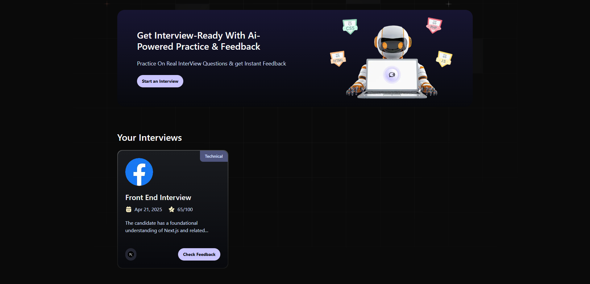

# AI Interview Agent


---

## 🚀 AI Interview Agent

**AI Interview Agent** is a next-generation, AI-powered platform designed to
help you master technical and behavioral interviews. Simulate real interview
scenarios, receive instant, actionable feedback, and track your progress—all in
a beautiful, interactive, and user-friendly environment.

> **Why choose AI Interview Agent?**
>
> - Realistic, role-specific interview simulations
> - Instant, AI-driven feedback and scoring
> - Personalized insights to boost your strengths and address weaknesses
> - Modern, accessible, and responsive UI

---

## ✨ Features

<div align="center">
  
</div>

- 🎤 **Simulate Technical & Behavioral Interviews** for various roles and levels
- ⚡ **Real-Time Feedback & Scoring** powered by advanced AI
- 📊 **Detailed Strengths & Improvement Analysis**
- 🏆 **Progress Dashboard** to track your interview history
- 🔒 **Authentication & User Management**
- 📱 **Mobile-First, Accessible UI**
- 🌐 **Modern Tech Stack** (Next.js, React, TypeScript, Tailwind CSS, Firebase)

---

## 🖼️ Screenshots

<div align="center">
  
</div>

---

## 🛠️ Technology Stack

- **Frontend:** Next.js, React, TypeScript, Tailwind CSS
- **Backend:** Next.js API routes
- **Database/Storage:** Firebase
- **UI Components:** Custom & Tailwind CSS
- **Utilities:** dayjs for date formatting

---

## 🚦 Getting Started

### Prerequisites

- Node.js (v16 or above)
- npm

### Installation

1. **Clone the repository:**
   ```bash
   git clone https://github.com/YussefMo/ai-mock-interviews.git
   ```
2. **Install dependencies:**
   ```bash
   npm install
   ```
3. **Configure environment variables:**
   - Copy `env.example.txt` to `.env.local` and fill in your Firebase and API keys.

### Running the App

```bash
npm run dev
```

Visit [http://localhost:3000](http://localhost:3000) in your browser.

### Building for Production

```bash
npm run build
npm start
```

---

## 📖 Usage Example

1. **Sign up or log in** to your account.
2. **Choose a role and interview type** (technical, behavioral, etc.).
3. **Start the interview simulation**—answer questions in real time.
4. **Receive instant feedback** with scores and improvement tips.
5. **Review your dashboard** to track progress and revisit past interviews.

---

## 🤔 FAQ

**Q: Is my data secure?** A: Yes, all data is securely stored using Firebase and
is only accessible to you.

**Q: Can I simulate interviews for different roles?** A: Absolutely! Choose from
a variety of roles and customize your interview experience.

**Q: How is feedback generated?** A: Feedback is powered by advanced AI models,
providing objective and actionable insights.

---

## 🤝 Contributing

We welcome contributions! To get started:

1. Fork the repository
2. Create a new branch (`git checkout -b feature/your-feature`)
3. Commit your changes
4. Push to your fork and submit a pull request

---

## 📂 Folder Structure

- `app/` - Main application pages and layouts
- `components/` - Reusable React components (UI, InterviewCard, FeedbackDisplay,
  etc.)
- `constants/` - Static constants
- `firebase/` - Firebase configuration and utilities
- `lib/` - Utility functions and server actions
- `public/` - Static assets (images, SVGs)
- `types/` - TypeScript type definitions

---

Feel free to open issues or contribute to help improve the platform!
